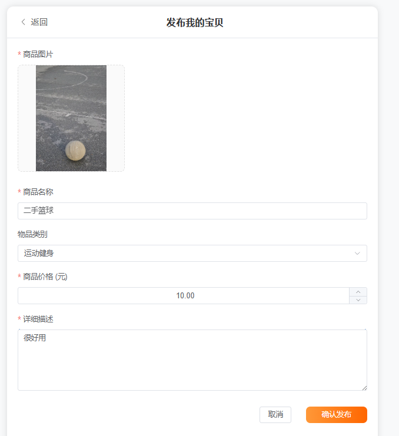
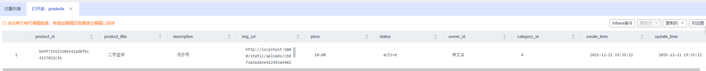
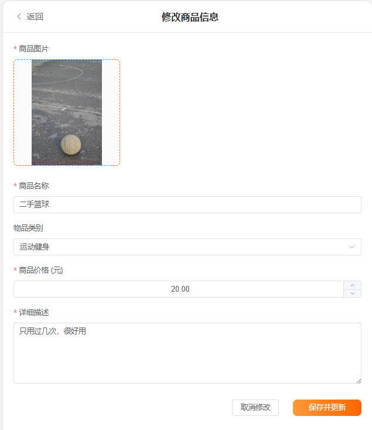
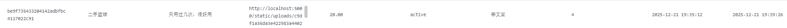

## 一、数据库基本表定义

本系统数据库中共包含8个基本表，具体定义如下：

### 1.1 用户表 (users)

| 属性名 | 中文 | 数据类型 | 备注 |
| :--- | :--- | :--- | :--- |
| user_name | 用户名 | varchar(32) | 主键 |
| password_md5 | 密码 | varchar(32) | MD5加密 |
| nickname | 昵称 | varchar(32) | |
| avatar_url | 头像链接 | varchar(256) | |
| phone | 手机号 | varchar(32) | |
| intro | 简介 | text | |
| create_time | 创建时间 | timestamp | |

### 1.2 商品表 (products)

| 属性名 | 中文 | 数据类型 | 备注 |
| :--- | :--- | :--- | :--- |
| product_id | 商品ID | varchar(32) | 主键 |
| product_title | 商品标题 | varchar(32) | |
| description | 商品描述 | text | |
| img_url | 图片链接 | varchar(256) | |
| price | 价格 | decimal(10,2) | |
| status | 状态 | varchar(32) | active/sold/deleted |
| owner_id | 卖家ID | varchar(32) | 外键 (关联users) |
| category_id | 分类ID | varchar(32) | 外键 (关联categories) |
| create_time | 发布时间 | timestamp | |
| update_time | 更新时间 | timestamp | |

### 1.3 订单表 (orders)

| 属性名 | 中文 | 数据类型 | 备注 |
| :--- | :--- | :--- | :--- |
| order_id | 订单ID | varchar(32) | 主键 |
| order_status | 订单状态 | varchar(32) | |
| buyer_id | 买家ID | varchar(32) | 外键 (关联users) |
| seller_id | 卖家ID | varchar(32) | 外键 (关联users) |
| product_id | 商品ID | varchar(32) | 外键 (关联products) |
| created_time | 下单时间 | timestamp | |

### 1.4 消息表 (message)

| 属性名 | 中文 | 数据类型 | 备注 |
| :--- | :--- | :--- | :--- |
| message_id | 消息ID | varchar(32) | 主键 |
| sender_id | 发送者ID | varchar(32) | 外键 (关联users) |
| receiver_id | 接收者ID | varchar(32) | 外键 (关联users) |
| time | 发送时间 | timestamp | |
| content | 消息内容 | text | |

### 1.5 评论表 (comment)

| 属性名 | 中文 | 数据类型 | 备注 |
| :--- | :--- | :--- | :--- |
| comment_id | 评论ID | varchar(32) | 主键 |
| user_id | 评论者ID | varchar(32) | 外键 (关联users) |
| product_id | 商品ID | varchar(32) | 外键 (关联products) |
| time | 评论时间 | timestamp | |
| rating | 评分 | int unsigned | |
| content | 评论内容 | text | |

### 1.6 商品分类表 (categories)

| 属性名 | 中文 | 数据类型 | 备注 |
| :--- | :--- | :--- | :--- |
| category_id | 分类ID | varchar(32) | 主键 |
| category_name | 分类名称 | varchar(32) | |

### 1.7 收藏夹表 (favorites)

| 属性名 | 中文 | 数据类型 | 备注 |
| :--- | :--- | :--- | :--- |
| favorite_id | 收藏夹ID | varchar(32) | 主键 |
| user_id | 用户ID | varchar(32) | 外键 (关联users) |
| created_time | 创建时间 | timestamp | |
| name | 收藏夹名称 | varchar(64) | |

### 1.8 收藏项表 (favorite_item)

| 属性名 | 中文 | 数据类型 | 备注 |
| :--- | :--- | :--- | :--- |
| favorite_id | 收藏夹ID | varchar(32) | 外键 (关联favorites) |
| product_id | 商品ID | varchar(32) | 外键 (关联products) |
| created_time | 收藏时间 | timestamp | |

## 二、	触发器与存储过程的设计与实现说明
### 2.1 触发器设计与实现说明

本项目为了保证数据的一致性与完整性，在数据库层面设计了三个关键的触发器。这些触发器能够自动处理订单生成后的商品状态变更、商品删除后的收藏夹清理以及数据更新时的时间戳维护，有效减轻了后端业务逻辑的复杂度。

#### 2.1.1 订单与商品状态联动触发器 (`after_order_insert`)
* 触发时机：`orders` 表发生 `INSERT` 操作之后。
* 功能描述：当用户下单生成新的订单记录时，触发器自动根据订单中的 `product_id`，将 `products` 表中对应商品的状态 (`status`) 更新为 `'sold'` (已售出)。
* 设计意义：确保“下单”与“下架”这两个动作的原子性，防止在高并发场景下出现“一货多卖”的情况。

```sql
DELIMITER $$

CREATE TRIGGER `after_order_insert` 
AFTER INSERT ON `orders`
FOR EACH ROW 
BEGIN
    -- 当生成新订单时，自动将对应商品标记为已售出
    UPDATE products 
    SET status = 'sold' 
    WHERE product_id = NEW.product_id;
END$$

DELIMITER ;
```
#### 2.1.2 收藏夹与评论级联清理触发器

* **触发时机**：`products` 表发生 `UPDATE` 操作之后。
* **功能描述**：本项目采用“软删除”策略。当商品状态变为 `'deleted'` 时，该触发器会执行两步清理操作：
    1. 从 `favorite_item` 表中删除所有关联该商品的收藏记录。
    2. 从 `comment` 表中删除该商品下的所有评论。
* **设计意义**：全方位维护数据的整洁性，确保商品“下架”后，与其相关的交互数据（收藏、评论）同步失效，释放存储空间并提升用户体验。

```sql
DELIMITER $$

CREATE TRIGGER `after_product_delete`
AFTER UPDATE ON `products`
FOR EACH ROW
BEGIN
    -- 监测商品状态是否变为 'deleted'
    IF NEW.status = 'deleted' THEN
        -- 1. 级联删除收藏夹中的相关记录
        DELETE FROM favorite_item WHERE product_id = NEW.product_id;
        -- 2. 级联删除该商品下的评论记录
        DELETE FROM comment WHERE product_id = NEW.product_id;
    END IF;
END$$

DELIMITER ;
```
#### 2.1.3 数据更新时间自动维护触发器
* 触发时机：`products` 表发生 `UPDATE` 操作之前 。

* 功能描述：每当商品信息（如价格、描述、标题）被修改时，触发器自动将当前系统时间赋值给 `update_time` 字段。

* 设计意义：自动化维护审计字段，无需后端代码显式传入时间，确保 `update_time` 永远反映数据的最后一次变动时间。

```SQL

DELIMITER $$

CREATE TRIGGER `before_product_update`
BEFORE UPDATE ON `products`
FOR EACH ROW
BEGIN
    -- 自动更新最后修改时间为当前时间
    SET NEW.update_time = NOW();
END$$

DELIMITER ;
```

#### 2.1.4 收藏夹删除前置清理触发器 (before_favorite_delete)
* **触发时机**：favorites 表发生 DELETE 操作之前 (BEFORE DELETE)。

* **功能描述**：当用户删除一个收藏夹时，该触发器会在物理删除文件夹记录之前，先自动清空 favorite_item 表中属于该文件夹的所有收藏项。

* **设计意义**：实现逻辑上的级联删除。由于 favorite_item 表依赖于 favorites 表的主键，如果直接删除文件夹会导致外键约束冲突或产生“孤儿数据”。该触发器保证了删除操作的原子性和数据的完整性。
* **实现代码**:

```sql
DELIMITER $$

CREATE TRIGGER `before_favorite_delete`
BEFORE DELETE ON `favorites`
FOR EACH ROW
BEGIN
    -- 在删除收藏夹之前，自动清空该夹子内的所有商品项
    DELETE FROM favorite_item WHERE favorite_id = OLD.favorite_id;
END$$

DELIMITER ;
```
## 2.2 存储过程设计与实现说明

本系统后端采用 Python 的 Flask 框架，利用 PyMySQL 库与 MySQL 数据库进行交互。数据存取逻辑（即广义上的存储过程）封装在后端的各个路由处理函数中。系统通过定义 API 接口接收前端请求，在后端执行 SQL 语句完成业务逻辑，并将结果以 JSON 格式返回。下面列出本应用中核心模块的 API 设计及实现代码。

### 2.2.1 用户模块
#### (1) 用户注册

* **请求路径**: `/api/register`
* **请求方法**: `POST`
* **请求数据格式**:
    * `username`: 字符串格式，用户设置的登录账号。
    * `password`: 字符串格式，用户设置的密码。
* **返回数据格式**: JSON 对象，包含 `message` 提示信息。

**实现代码**:

```python
@auth_bp.route("/register", methods=["POST"])
def register():
    data = request.json
    user_name = data.get("username")
    password = data.get("password")

    conn = get_db_connection()
    cursor = conn.cursor()
    try:
        # 检查用户是否已存在
        cursor.execute("SELECT user_name FROM users WHERE user_name = %s", (user_name,))
        if cursor.fetchone():
            return jsonify({"message": "用户名已存在"}), 409

        # 插入新用户
        hashed_password = md5(password)
        cursor.execute("""
            INSERT INTO users (user_name, password_md5, create_time)
            VALUES (%s, %s, NOW())
        """, (user_name, hashed_password))
        conn.commit()
        return jsonify({"message": "注册成功"}), 201
    except Exception as e:
        conn.rollback()
        return jsonify({"message": "服务器内部错误"}), 500
    finally:
        cursor.close()
        conn.close()
```

#### (2) 用户登录

* **请求路径**: `/api/login`
* **请求方法**: `POST`
* **请求数据格式**:
    * `username`: 字符串格式，登录账号。
    * `password`: 字符串格式，登录密码。
* **返回数据格式**:
    * `token`: 字符串格式，用于身份验证的令牌。
    * `message`: 操作结果提示。

**实现代码**:

```python
@auth_bp.route("/login", methods=["POST"])
def login():
    data = request.json
    user_name = data.get("username")
    password = data.get("password")

    conn = get_db_connection()
    cursor = conn.cursor(pymysql.cursors.DictCursor)
    try:
        # 验证用户名与密码
        cursor.execute("SELECT user_name, password_md5 FROM users WHERE user_name = %s", (user_name,))
        user = cursor.fetchone()

        if user and md5(password) == user["password_md5"]:
            token = generate_token(user_name)
            return jsonify({"token": token, "message": "登录成功"}), 200
        else:
            return jsonify({"message": "用户名或密码错误"}), 401
    finally:
        cursor.close()
        conn.close()
```

### 2.2.2 商品模块

#### (1) 发布商品

* **请求路径**: `/api/create_product`
* **请求方法**: `POST`
* **请求数据格式**:
    * `name`: 字符串，商品标题。
    * `price`: 浮点数，商品价格。
    * `category_id`: 字符串，商品所属分类ID。
    * `description`: 字符串，商品描述。
    * `image_url`: 字符串，图片路径。
* **返回数据格式**: 包含 `product_id` 和成功信息。

**实现代码**:

```python
@product_bp.route("/create_product", methods=["POST"])
def create_product():
    # Token 验证略...
    data = request.json
    new_id = generate_uuid()
    
    conn = get_db_connection()
    cursor = conn.cursor()
    try:
        sql = """
            INSERT INTO products 
            (product_id, product_title, price, img_url, description, category_id, owner_id, status, create_time, update_time)
            VALUES (%s, %s, %s, %s, %s, %s, %s, 'active', NOW(), NOW())
        """
        cursor.execute(sql, (new_id, data.get("name"), data.get("price"), 
                             data.get("image_url"), data.get("description"), 
                             data.get("category_id"), user_name))
        conn.commit()
        return jsonify({"message": "商品发布成功", "product_id": new_id}), 201
    finally:
        cursor.close()
        conn.close()
```

#### (2) 商品搜索

* **请求路径**: `/api/search_products`
* **请求方法**: `GET`
* **请求参数**: `keyword` (URL参数)，表示搜索关键词。
* **返回数据格式**: `products` 数组，包含匹配的商品列表。

**实现代码**:

```python
@product_bp.route("/search_products", methods=["GET"])
def search_products():
    keyword = request.args.get("keyword", "").strip()
    conn = get_db_connection()
    cursor = conn.cursor(pymysql.cursors.DictCursor)
    try:
        # 使用 LIKE 进行模糊查询
        sql = """
            SELECT p.*, u.nickname as seller_name, u.avatar_url as seller_avatar
            FROM products p
            LEFT JOIN users u ON p.owner_id = u.user_name
            WHERE p.status = 'active' 
            AND (p.product_title LIKE %s OR p.description LIKE %s)
            ORDER BY p.create_time DESC
        """
        search_pattern = f"%{keyword}%"
        cursor.execute(sql, (search_pattern, search_pattern))
        products = cursor.fetchall()
        # 数据格式化略...
        return jsonify({"products": result_list, "message": "搜索完成"}), 200
    finally:
        cursor.close()
        conn.close()
```
#### (3) 修改商品信息

* **请求路径**: `/api/modify_product`
* **请求方法**: `POST`
* **功能说明**: 允许卖家修改已发布商品的信息（如价格、描述）。后端会校验操作者是否为该商品的拥有者（Owner）。
* **返回数据格式**: 成功/失败提示。

**实现代码**:

```python
@product_bp.route("/modify_product", methods=["POST"])
def modify_product():
    # Token 验证略...
    data = request.json
    product_id = data.get("id")
    
    conn = get_db_connection()
    cursor = conn.cursor()
    try:
        # 权限校验：确保只有商品发布者(owner_id)才能修改
        sql = """
            UPDATE products 
            SET product_title = %s, price = %s, img_url = %s, description = %s, category_id = %s, update_time = NOW()
            WHERE product_id = %s AND owner_id = %s
        """
        affected = cursor.execute(sql, (data.get("name"), data.get("price"), data.get("image_url"), 
                                        data.get("description"), data.get("category_id"), 
                                        product_id, user_name))
        conn.commit()
        if affected == 0:
            return jsonify({"message": "修改失败：无权操作或商品不存在"}), 403
        return jsonify({"message": "商品修改成功"}), 200
    finally:
        cursor.close()
        conn.close()
```

#### (4) 删除商品 (软删除)
* **请求路径**: `/api/delete_product/<product_id>`
* **请求方法**: `DELETE`
* **功能说明**: 采用“软删除”策略，不物理删除记录，而是将状态标记为 deleted，以保留历史订单数据。
* **返回数据格式**: 成功/失败提示。
**实现代码**:

```python
@product_bp.route("/delete_product/<product_id>", methods=["DELETE"])
def delete_product(product_id):
    # Token 验证略...
    conn = get_db_connection()
    cursor = conn.cursor()
    try:
        # 执行软删除：更新 status 字段
        sql = "UPDATE products SET status = 'deleted', update_time = NOW() WHERE product_id = %s AND owner_id = %s"
        affected = cursor.execute(sql, (product_id, user_name))
        conn.commit()
        
        if affected == 0:
            return jsonify({"message": "删除失败"}), 403
        return jsonify({"message": "商品已删除"}), 200
    finally:
        cursor.close()
        conn.close()
```

### 2.2.3 订单模块

#### (1) 购买商品 (事务处理)

* **请求路径**: `/api/buy_product/<product_id>`
* **请求方法**: `POST`
* **功能说明**: 通过数据库事务保证订单生成与商品状态变更的一致性。
* **返回数据格式**: 包含生成的 `order_id`。

**实现代码**:

```python
@order_bp.route("/buy_product/<product_id>", methods=["POST"])
def buy_product(product_id):
    # Token 验证略...
    conn = get_db_connection()
    cursor = conn.cursor(pymysql.cursors.DictCursor)
    try:
        # 1. 检查商品状态
        cursor.execute("SELECT * FROM products WHERE product_id = %s", (product_id,))
        product = cursor.fetchone()
        if not product or product['status'] != 'active':
            return jsonify({"message": "商品已售出或下架"}), 409

        # 2. 开启事务：插入订单
        # 注：商品状态更新已交由数据库触发器 after_order_insert 自动处理
        order_id = generate_uuid()
        insert_sql = """
            INSERT INTO orders 
            (order_id, order_status, buyer_id, seller_id, product_id, created_time)
            VALUES (%s, 'completed', %s, %s, %s, NOW())
        """
        cursor.execute(insert_sql, (order_id, user_name, product['owner_id'], product_id))
        
        conn.commit() # 提交事务
        return jsonify({"message": "购买成功", "order_id": order_id}), 200
    except Exception as e:
        conn.rollback() # 回滚
        return jsonify({"message": "交易失败"}), 500
    finally:
        cursor.close()
        conn.close()
```

#### (2) 获取我的订单列表

* **请求路径**: `/api/get_orders`
* **请求方法**: `GET`
* **功能说明**: 查询当前登录用户的所有订单，通过 `JOIN` 操作关联 `products` 表，同时返回商品的标题、图片等详细信息。
* **返回数据格式**: `orders` 数组。

**实现代码**:

```python
@order_bp.route("/get_orders", methods=["GET"])
def get_orders():
    # Token 验证略...
    conn = get_db_connection()
    cursor = conn.cursor(pymysql.cursors.DictCursor)
    try:
        # 使用 JOIN 关联查询：同时获取订单状态和商品快照信息
        sql = """
            SELECT o.order_id, o.order_status, o.created_time,
                   p.product_title, p.img_url, p.price, o.seller_id
            FROM orders o
            JOIN products p ON o.product_id = p.product_id
            WHERE o.buyer_id = %s
            ORDER BY o.created_time DESC
        """
        cursor.execute(sql, (user_name,))
        orders = cursor.fetchall()
        
        # 时间格式化处理略...
        return jsonify({"orders": orders, "message": "获取成功"}), 200
    finally:
        cursor.close()
        conn.close()
```

### 2.2.4 互动模块

#### (1) 发布评论

* **请求路径**: `/api/publish_comment`
* **请求方法**: `POST`
* **请求数据格式**:
    * `product_id`: 被评论的商品ID。
    * `content`: 评论内容。
    * `rate`: 评分（1-5）。
* **返回数据格式**: 成功提示信息。

**实现代码**:

```python
@interaction_bp.route("/publish_comment", methods=["POST"])
def publish_comment():
    # Token 验证略...
    data = request.json
    conn = get_db_connection()
    cursor = conn.cursor()
    try:
        comment_id = generate_uuid()
        sql = """
            INSERT INTO comment 
            (comment_id, user_id, product_id, time, rating, content)
            VALUES (%s, %s, %s, NOW(), %s, %s)
        """
        cursor.execute(sql, (comment_id, user_name, data.get("product_id"), 
                             data.get("rate", 5), data.get("content")))
        conn.commit()
        return jsonify({"message": "评论发布成功"}), 201
    finally:
        cursor.close()
        conn.close()
```

#### (2) 获取收藏夹列表

* **请求路径**: `/api/get_favorites`
* **请求方法**: `GET`
* **功能说明**: 执行复杂的三表连接查询。先通过 `users` 找到 `favorites`，再通过 `favorite_item` 关联出具体的 `products` 信息。
* **返回数据格式**: `favorites` 数组（包含商品详情）。

**实现代码**:

```python
@interaction_bp.route("/get_favorites", methods=["GET"])
def get_favorites():
    # Token 验证略...
    conn = get_db_connection()
    cursor = conn.cursor(pymysql.cursors.DictCursor)
    try:
        # 三表连接查询：favorites -> favorite_item -> products
        sql = """
            SELECT p.* FROM favorites f
            JOIN favorite_item fi ON f.favorite_id = fi.favorite_id
            JOIN products p ON fi.product_id = p.product_id
            WHERE f.user_id = %s
        """
        cursor.execute(sql, (user_name,))
        favorites = cursor.fetchall()
        return jsonify({"favorites": favorites}), 200
    finally:
        cursor.close()
        conn.close()
```

#### (3) 获取私信列表
* **请求路径**: `/api/get_msgs`
* **请求方法**: `GET`
* **功能说明**: 获取当前用户的完整对话流。查询条件包含逻辑或（OR），即检索“我发送的”或者“我接收的”所有消息，并按时间倒序排列。
* **返回数据格式**: `messages` 数组。
**实现代码**:

```python
@interaction_bp.route("/get_msgs", methods=["GET"])
def get_msgs():
    # Token 验证略...
    conn = get_db_connection()
    cursor = conn.cursor(pymysql.cursors.DictCursor)
    try:
        # 使用 OR 逻辑查询双向消息
        sql = """
            SELECT m.*, u.nickname as sender_nickname, u.avatar_url as sender_avatar
            FROM message m
            JOIN users u ON m.sender_id = u.user_name
            WHERE m.receiver_id = %s OR m.sender_id = %s
            ORDER BY m.time DESC
        """
        cursor.execute(sql, (user_name, user_name))
        msgs = cursor.fetchall()
        return jsonify({"messages": msgs}), 200
    finally:
        cursor.close()
        conn.close()
```

#### (4) 删除评论

* **请求路径**: `/api/delete_comment/<comment_id>`
* **请求方法**: `DELETE`
* **功能说明**: 允许用户删除自己发布的评论。
* **返回数据格式**: 成功/失败提示。

**实现代码**:

```python
@interaction_bp.route("/delete_comment/<comment_id>", methods=["DELETE"])
def delete_comment(comment_id):
    # Token 验证略...
    conn = get_db_connection()
    cursor = conn.cursor(pymysql.cursors.DictCursor)
    try:
        # 验证归属权
        cursor.execute("SELECT user_id FROM comment WHERE comment_id = %s", (comment_id,))
        comment = cursor.fetchone()
        if not comment or comment['user_id'] != user_name:
            return jsonify({"message": "无权删除"}), 403

        cursor.execute("DELETE FROM comment WHERE comment_id = %s", (comment_id,))
        conn.commit()
        return jsonify({"message": "评论已删除"}), 200
    finally:
        cursor.close()
        conn.close()
```

### 2.2.5 收藏夹管理模块

本系统支持多收藏夹管理功能，用户可以创建自定义收藏夹，并将商品分类收藏。

#### (1) 创建与获取收藏夹

* **请求路径**: `/api/create_favorite_folder` (POST) / `/api/favorite_folders` (GET)
* **功能说明**: 用户可以创建自定义命名的收藏夹；系统支持按创建时间倒序展示用户的收藏夹列表。

**实现代码 (创建收藏夹)**:

```python
@interaction_bp.route("/create_favorite_folder", methods=["POST"])
def create_favorite_folder():
    # Token 验证略...
    folder_name = request.json.get("name")
    folder_id = generate_uuid()
    
    conn = get_db_connection()
    cursor = conn.cursor()
    try:
        # 插入新收藏夹记录
        sql = "INSERT INTO favorites (favorite_id, user_id, name, created_time) VALUES (%s, %s, %s, NOW())"
        cursor.execute(sql, (folder_id, user_name, folder_name))
        conn.commit()
        return jsonify({"message": "创建成功", "id": folder_id}), 201
    finally:
        cursor.close()
        conn.close()
```

#### (2) 收藏商品到指定文件夹
* **请求路径**: `/api/favorite_product`
* **请求方法**: `POST`
* **请求数据**: `product_id`, `folder_id`
* **功能说明**: 将商品关联到指定的收藏夹中。系统会检查是否重复收藏以保证幂等性。

**实现代码:**
```python
@interaction_bp.route("/favorite_product", methods=["POST"])
def add_favorite_product():
    # Token 验证略...
    data = request.json
    conn = get_db_connection()
    cursor = conn.cursor()
    try:
        # 检查是否已存在
        cursor.execute("SELECT * FROM favorite_item WHERE favorite_id = %s AND product_id = %s", 
                       (data.get("folder_id"), data.get("product_id")))
        if cursor.fetchone():
            return jsonify({"message": "已收藏"}), 200

        # 插入收藏项
        sql = "INSERT INTO favorite_item (favorite_id, product_id, created_time) VALUES (%s, %s, NOW())"
        cursor.execute(sql, (data.get("folder_id"), data.get("product_id")))
        conn.commit()
        return jsonify({"message": "收藏成功"}), 201
    finally:
        cursor.close()
        conn.close()
```

#### (3) 删除收藏夹
* **请求路径**: `/api/delete_favorite_folder/<folder_id>`
* **请求方法**: `DELETE`
* **功能说明**: 删除指定收藏夹及其所有包含的商品项。采用级联删除策略，确保数据完整性。
* **实现代码**:

```python
@interaction_bp.route("/delete_favorite_folder/<folder_id>", methods=["DELETE"])
def delete_favorite_folder(folder_id):
    # Token 验证略...
    conn = get_db_connection()
    cursor = conn.cursor()
    try:
        # 验证归属权
        cursor.execute("SELECT * FROM favorites WHERE favorite_id = %s AND user_id = %s", (folder_id, user_name))
        if not cursor.fetchone(): return jsonify({"message": "无权操作"}), 403

        # 级联删除：先删条目，再删文件夹
        cursor.execute("DELETE FROM favorite_item WHERE favorite_id = %s", (folder_id,))
        cursor.execute("DELETE FROM favorites WHERE favorite_id = %s", (folder_id,))
        conn.commit()
        return jsonify({"message": "收藏夹已删除"}), 200
    finally:
        cursor.close()
        conn.close()
```

## 三、系统各项功能数据库端操作主要代码与结果说明

本章节重点展示系统核心业务逻辑在数据库层面的实现。后端通过 PyMySQL 驱动执行 SQL 语句，实现了数据的增删改查及完整性维护。
### 3.1 发布新商品 

**功能描述**：
用户在前端填写商品信息（标题、价格、图片、描述）并提交。后端接收请求后，生成唯一的 UUID 作为 `product_id`，并将数据插入 `products` 表。同时，系统利用数据库函数 `NOW()` 自动记录商品的发布时间 (`create_time`) 和最后修改时间 (`update_time`)。

**核心代码实现**：

```python
sql = """
    INSERT INTO products 
    (product_id, product_title, price, img_url, description, category_id, owner_id, status, create_time, update_time)
    VALUES (%s, %s, %s, %s, %s, %s, %s, 'active', NOW(), NOW())
"""
cursor.execute(sql, (new_id, data.get("name"), data.get("price"), 
                     data.get("image_url"), data.get("description"), 
                     data.get("category_id"), user_name))

```

**执行结果**：
在前端“发布商品”页面填写信息并点击提交。



### 3.2 修改商品信息 (权限校验与更新)
**功能描述**：
卖家可以随时修改自己发布的商品信息。后端在执行 `UPDATE` 操作时，增加了 `WHERE owner_id = %s` 条件，确保只有商品的发布者才能修改该记录，实现了数据库层面的权限控制。同时，`update_time` 字段会通过触发器或 SQL 语句自动更新为当前时间。

**核心代码实现**：

```
# SQL 逻辑：更新商品信息
# 权限控制：通过 AND owner_id = %s 确保只能改自己的商品
# 审计字段：手动或触发器更新 update_time
sql = """
    UPDATE products 
    SET product_title = %s, price = %s, img_url = %s, description = %s, category_id = %s, update_time = NOW()
    WHERE product_id = %s AND owner_id = %s
"""
cursor.execute(sql, (data.get("name"), data.get("price"), data.get("image_url"), 
                     data.get("description"), data.get("category_id"), 
                     product_id, user_name))

```

**执行结果**：
用户修改了某个商品的价格和描述。(在图片的例子里是上一个例子中的篮球)




### 3.3 商品模糊搜索 (多表连接查询)

**功能描述**：
系统支持根据关键词搜索商品。为了在展示商品列表时能够同时显示卖家的头像和昵称，后端使用了 `LEFT JOIN` 将 `products` 表与 `users` 表关联。这种“一次查询，获取所有”的方式避免了 N+1 查询问题，提升了数据库性能。

**核心代码实现**：

```
# SQL 逻辑：
# 1. 使用 LIKE 关键字实现对标题和描述的模糊匹配
# 2. 使用 LEFT JOIN 关联 users 表，获取 seller_name 和 seller_avatar
sql = """
    SELECT p.*, u.nickname as seller_name, u.avatar_url as seller_avatar
    FROM products p
    LEFT JOIN users u ON p.owner_id = u.user_name
    WHERE p.status = 'active' 
    AND (p.product_title LIKE %s OR p.description LIKE %s)
    ORDER BY p.create_time DESC
"""
search_pattern = f"%{keyword}%"
cursor.execute(sql, (search_pattern, search_pattern))

```

**执行结果说明**：
在前端搜索框输入关键词（例如“书”）。

* **图 4-4** 展示了前端搜索结果页面。列表正确显示了包含“书”字的商品，且每个商品卡片左下角都正确加载了卖家的头像和昵称，验证了多表连接查询的正确性。
* **[此处请插入图 4-4：前端搜索结果页截图，重点展示搜索出来的商品列表]**

### 4.4 删除商品 (软删除与级联清理)

**功能描述**：
为了保留历史交易数据，商品删除采用“软删除”策略。后端执行 `UPDATE` 操作将商品状态标记为 `deleted`。同时，数据库触发器 `after_product_delete` 会自动监测此状态变化，一旦发现商品被删除，立即级联删除该商品在 `favorite_item` 表（收藏）和 `comment` 表（评论）中的所有记录，保证数据的整洁性。

**核心代码实现**：

```
# SQL 逻辑：执行软删除，不物理删除记录
# 触发器联动：状态变为 'deleted' 后，触发器自动清理收藏和评论
sql = "UPDATE products SET status = 'deleted', update_time = NOW() WHERE product_id = %s AND owner_id = %s"
affected = cursor.execute(sql, (product_id, user_name))

```

**执行结果说明**：
用户删除了一个已发布的商品。

* **图 4-5** 展示了数据库 `products` 表中，该记录的 `status` 字段变更为 `deleted`。
* **图 4-6** 展示了数据库 `comment` 表的查询结果。在删除操作前，该商品下有若干评论；删除操作后，这些评论记录已被触发器自动清空。
* **[此处请插入图 4-5：Navicat 截图，显示商品状态变为 deleted]**
* **[此处请插入图 4-6：Navicat 截图，证明该 ID 对应的评论数据为空]**

### 4.5 购买商品 (事务控制与状态联动)

**功能描述**：
这是系统的核心交易功能。为了保证订单生成与商品下架的原子性，后端代码开启了数据库事务（Transaction）。操作仅需向 `orders` 表插入一条记录，数据库后置触发器 `after_order_insert` 会自动捕获该操作，并将 `products` 表中对应商品的状态更新为 `sold`，防止超卖。

**核心代码实现**：

```
try:
    # 1. 开启事务，插入订单记录
    # Python端无需显式更新商品状态，完全交由数据库触发器处理
    insert_sql = """
        INSERT INTO orders 
        (order_id, order_status, buyer_id, seller_id, product_id, created_time)
        VALUES (%s, 'completed', %s, %s, %s, NOW())
    """
    cursor.execute(insert_sql, (order_id, user_name, seller_id, product_id))

    # 2. 提交事务 (Commit)
    # 此时触发器被激活，自动锁定并更新商品状态为 'sold'
    conn.commit() 
except Exception as e:
    conn.rollback()

```

**执行结果说明**：
在前端点击购买按钮。

* **图 4-7** 展示了购买成功后的前端提示。
* **图 4-8** 展示了数据库层面的变化：`orders` 表新增了交易记录，同时 `products` 表中该商品的状态已自动由 `active` 变为 `sold`，验证了事务与触发器的协同工作。
* **[此处请插入图 4-7：前端购买成功提示截图]**
* **[此处请插入图 4-8：Navicat 截图，展示 orders 表新增记录 和 products 表状态变化]**

### 4.6 查看我的订单 (内连接查询)

**功能描述**：
用户查看订单列表时，不仅需要知道订单号和状态，还需要看到所购买商品的详细信息（如图片、标题、价格）。后端使用 `JOIN` 语句将 `orders` 表与 `products` 表进行内连接，一次性获取所有必要数据，并按订单创建时间倒序排列。

**核心代码实现**：

```
# SQL 逻辑：
# 使用 JOIN 关联 products 表，获取商品快照信息
sql = """
    SELECT o.order_id, o.order_status, o.created_time,
           p.product_title, p.img_url, p.price, o.seller_id
    FROM orders o
    JOIN products p ON o.product_id = p.product_id
    WHERE o.buyer_id = %s
    ORDER BY o.created_time DESC
"""
cursor.execute(sql, (user_name,))

```

**执行结果说明**：

* **图 4-9** 展示了前端“我的订单”页面。列表清晰展示了用户购买过的商品缩略图、标题和价格，证明了后端 `JOIN` 查询逻辑的正确性。
* **[此处请插入图 4-9：前端“我的订单”页面截图]**

### 4.7 查看收藏详情 (三表连接查询)

**功能描述**：
收藏系统采用“多文件夹”结构。为了展示某个特定收藏夹内的商品详情，后端需要执行复杂的 **三表连接查询**。路径为：从 `favorites` 表（确认归属）关联到 `favorite_item` 表（中间表），再关联到 `products` 表（获取商品具体信息），最后按收藏时间倒序排列。

**核心代码实现**：

```
# SQL 逻辑：
# 涉及三张表的级联查询：favorites -> favorite_item -> products
# 目的：一次性查出该文件夹下所有商品的标题、价格、图片
sql = """
    SELECT p.product_id, p.product_title as name, p.price, p.img_url, fi.created_time
    FROM favorites f
    JOIN favorite_item fi ON f.favorite_id = fi.favorite_id
    JOIN products p ON fi.product_id = p.product_id
    WHERE f.favorite_id = %s AND f.user_id = %s
    ORDER BY fi.created_time DESC
"""
cursor.execute(sql, (folder_id, user_name))

```

**执行结果说明**：
用户点击进入名为“考研资料”的收藏夹。

* **图 4-10** 展示了前端界面。系统成功列出了该收藏夹内的所有商品卡片，且商品信息完整（包含图片和价格），验证了三表 JOIN 逻辑的正确性。
* **[此处请插入图 4-10：前端网页截图，展示某个收藏夹里面的商品列表]**

### 4.8 删除收藏夹 (前置触发器级联清理)

**功能描述**：
当用户删除收藏夹时，必须保证数据的一致性，防止 `favorite_item` 表中出现指向不存在文件夹的“孤儿数据”。系统利用数据库的 `BEFORE DELETE` 触发器，在删除 `favorites` 表记录之前，自动先清空 `favorite_item` 表中属于该文件夹的所有条目，实现了逻辑闭环。

**核心代码实现**：

```
# SQL 逻辑：
# Python端代码非常简洁，仅需执行删除文件夹的语句
# 复杂的级联清理工作完全下沉至数据库触发器 before_favorite_delete 处理
sql = "DELETE FROM favorites WHERE favorite_id = %s AND user_id = %s"
cursor.execute(sql, (folder_id, user_name))

```

**执行结果说明**：
用户删除了一个包含多件商品的收藏夹。

* **图 4-11** 展示了前端收藏夹列表，该文件夹已消失。
* **图 4-12** 展示了数据库验证结果。操作前，`favorite_item` 表中有若干条记录属于该文件夹；操作后，查询发现不仅 `favorites` 表中文件夹记录被删，`favorite_item` 表中对应的商品记录也已被触发器自动清除。
* **[此处请插入图 4-11：前端截图，收藏夹列表变少了]**
* **[此处请插入图 4-12：Navicat 截图，证明 favorite_item 表里的数据也被删干净了]**

### 3.9 消息系统 (复杂逻辑查询)

**功能描述**：
私信系统需要构建完整的对话流。这要求数据库查询不仅要找到“别人发给我的”消息，还要找到“我发给别人”的消息。后端使用 `WHERE ... OR ...` 复合条件进行筛选，并 `JOIN` 用户表获取对方的头像信息，最后按时间倒序排列，从而在前端还原出类似微信的聊天体验。

**核心代码实现**：

```
# SQL 逻辑：
# 1. 使用 OR 逻辑同时获取“我接收的(receiver_id=me)”和“我发送的(sender_id=me)”
# 2. 关联 users 表获取发送者的头像和昵称
sql = """
    SELECT m.*, u.nickname as sender_nickname, u.avatar_url as sender_avatar
    FROM message m
    JOIN users u ON m.sender_id = u.user_name
    WHERE m.receiver_id = %s OR m.sender_id = %s
    ORDER BY m.time DESC
"""
# 传入两次 user_name 分别匹配 receiver_id 和 sender_id
cursor.execute(sql, (user_name, user_name))

```

**执行结果说明**：

* **图 4-13** 展示了前端的私信聊天窗口。界面清晰地渲染了双向对话气泡，且所有消息严格按时间先后顺序排列，验证了后端 `OR` 查询与排序逻辑的有效性。
* **[此处请插入图 4-13：前端网页截图，漂亮的聊天窗口，显示双方对话]**